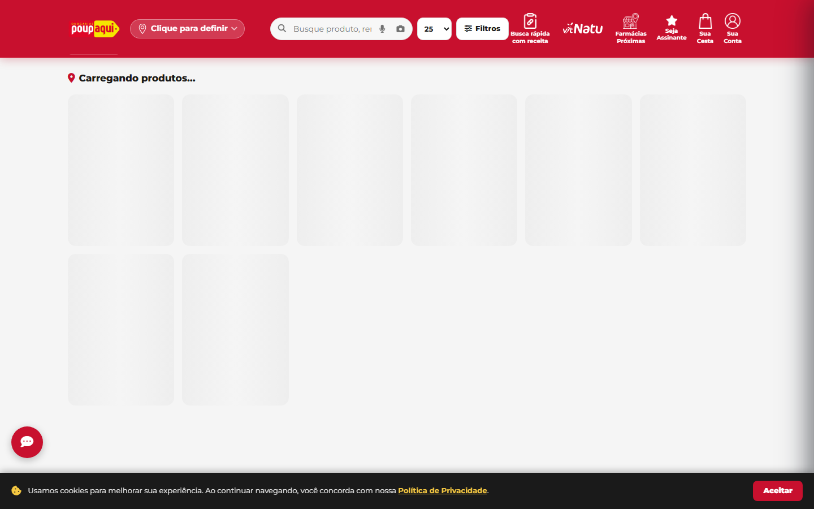
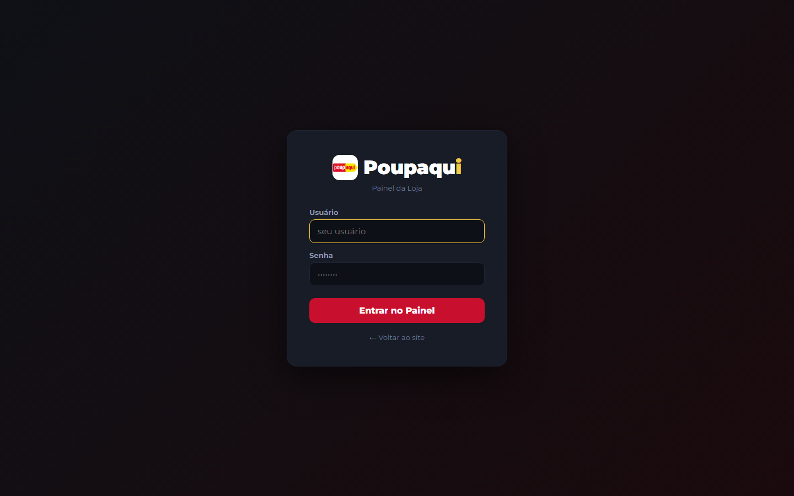
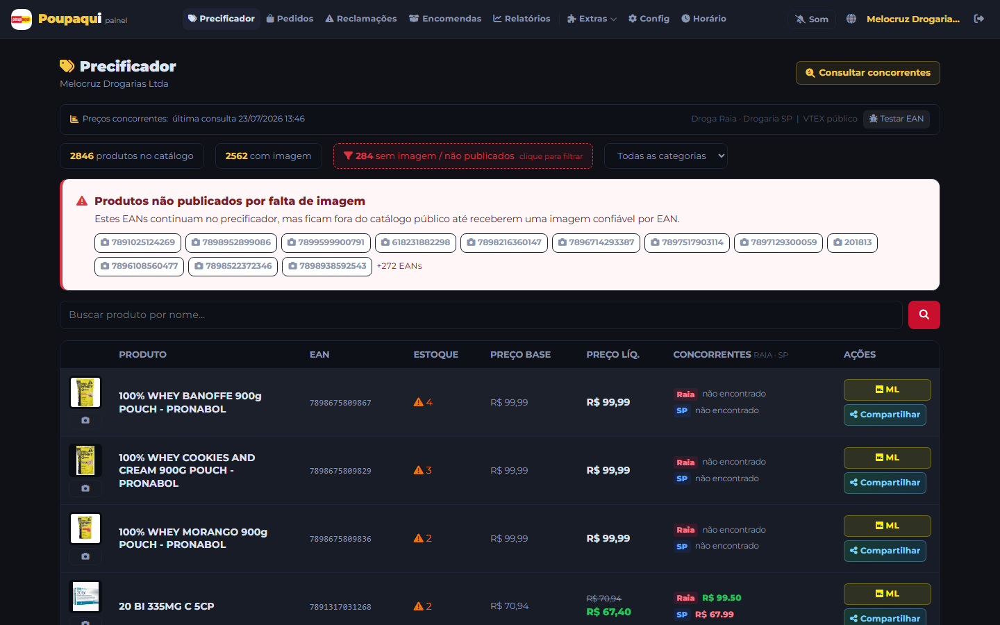
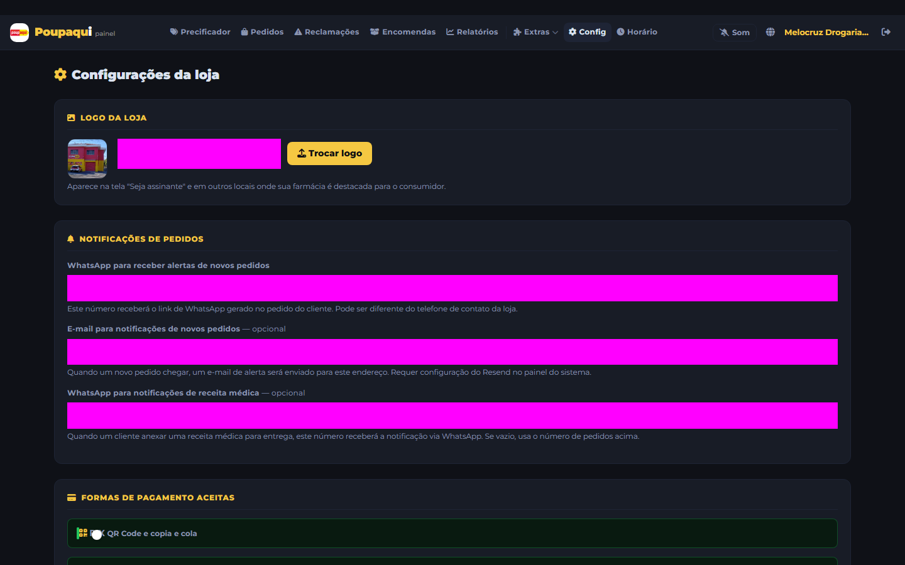
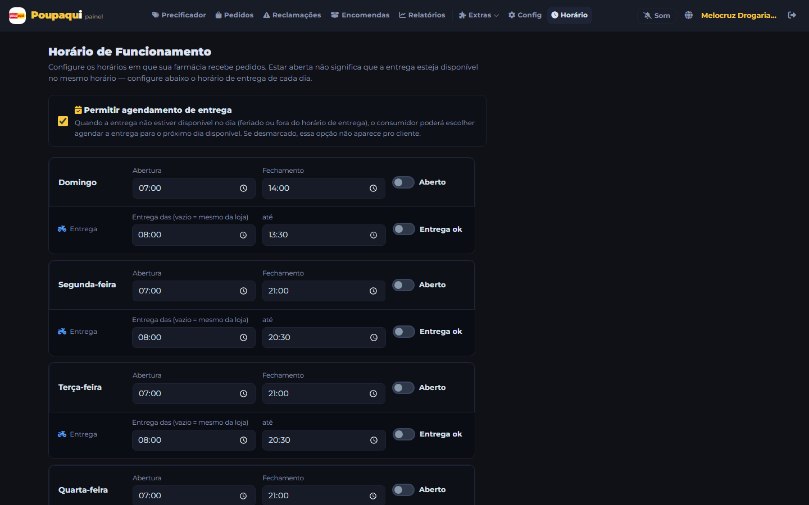
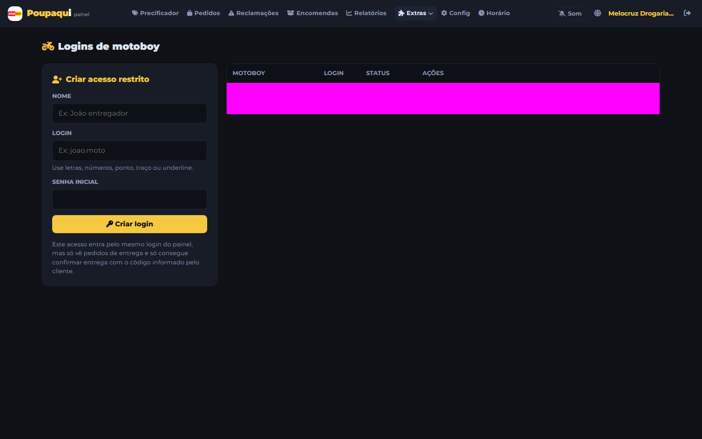
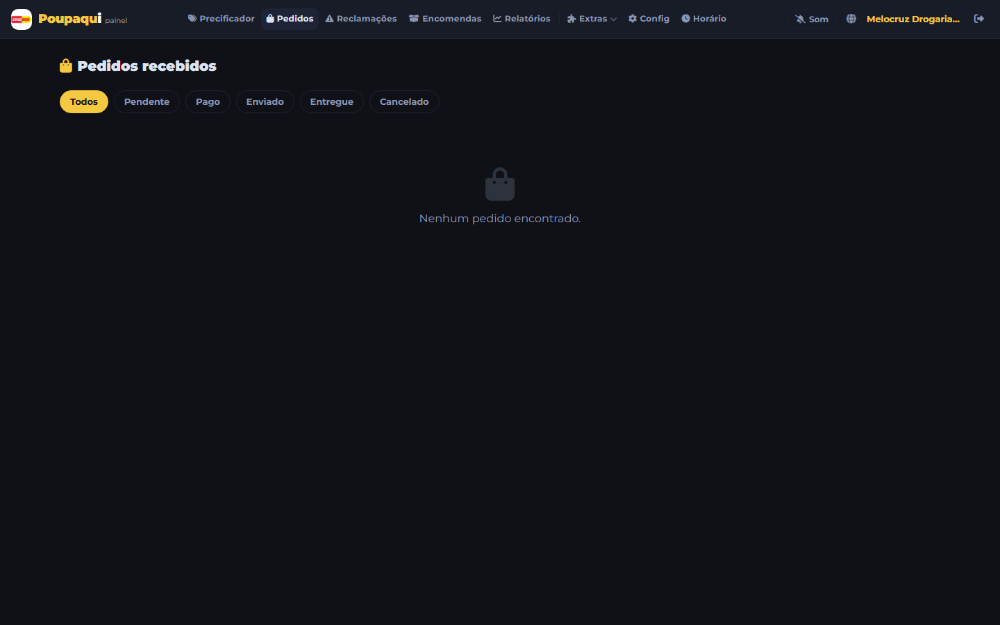
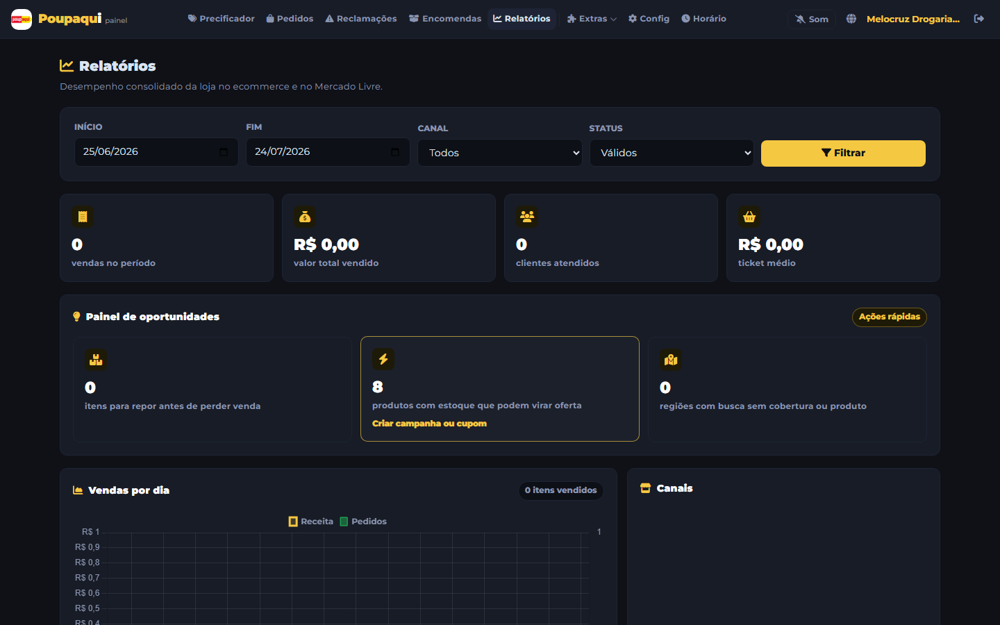

# Poupaqui Ecommerce

## Documento mestre de operação, custos, implantação e proposta de valor

**Versão:** 1.0  
**Data-base:** 24 de julho de 2026  
**Endereço oficial:** https://www.drogariaspoupaqui.com.br  
**Painel de lojas e entregadores:** https://www.drogariaspoupaqui.com.br/painel

> Documento estratégico e operacional para uso da Licence Farma, da rede Poupaqui e de seus licenciados. Os preços externos são referências públicas na data-base e devem ser confrontados com as faturas e painéis de cada fornecedor antes de qualquer decisão financeira.

---

## 1. Visão executiva

O Poupaqui Ecommerce é uma plataforma própria de comércio eletrônico farmacêutico, com experiência web e PWA instalável em Android e iPhone. A solução aproxima o consumidor da loja licenciada mais adequada, apresenta produtos e preços do estoque integrado, permite pedidos, pagamentos, retirada ou entrega e oferece à loja um painel operacional completo.

A plataforma não substitui a loja física. Ela amplia a presença da loja para uma jornada **omnichannel**: o cliente pesquisa no celular, compara disponibilidade, compra on-line e recebe em casa ou retira presencialmente. A loja mantém a responsabilidade sobre preço, estoque, dispensação, atendimento e entrega; a Licence Farma mantém a plataforma, as integrações, a governança e a evolução do ecossistema.

### Resultado que o projeto busca

- Transformar cada licenciado em um ponto de venda digital local.
- Capturar demanda que hoje começa em buscadores, redes sociais, marketplaces e aplicativos.
- Exibir estoque e preço da loja para consumidores próximos.
- Criar recorrência e relacionamento direto com o consumidor.
- Dar à rede dados sobre procura, vendas, produtos e regiões.
- Fortalecer a marca Poupaqui com uma experiência digital única.
- Permitir crescimento digital sem exigir que cada loja construa seu próprio e-commerce.

---

## 2. Por que o licenciado deve participar

### 2.1 O consumidor já compra on-line

Segundo a ABComm, o e-commerce brasileiro movimentou **R$ 235,52 bilhões em 2025**, com **438,92 milhões de pedidos** e **94,23 milhões de compradores on-line**. A pesquisa CNDL/SPC Brasil de 2025 apontou que **73% dos entrevistados compraram pela internet nos 12 meses anteriores** e **71% compram on-line pelo menos uma vez por mês**.

No varejo farmacêutico, o dado é ainda mais diretamente aplicável: as 29 redes acompanhadas pela Abrafarma movimentaram **R$ 21,58 bilhões em vendas digitais** entre dezembro de 2024 e novembro de 2025, uma expansão de **54,82%** sobre o período anterior. O número de consumidores no canal digital cresceu **39,85%**.

Fontes:

- [ABComm — crescimento do e-commerce brasileiro](https://dados.abcomm.org/crescimento-do-ecommerce-brasileiro)
- [CNDL/SPC Brasil — 71% compram on-line mensalmente](https://cndl.org.br/varejosa/71-dos-consumidores-compram-online-mensalmente-aponta-pesquisa-cndl-spc-brasil/)
- [Abrafarma — vendas digitais no setor farmacêutico ultrapassam R$ 20 bilhões](https://www.abrafarma.com.br/noticias/vendas-digitais-no-setor-farmaceutico-crescem-e-ultrapassam-r-20-bilhoes)
- [Sebrae — importância da estratégia omnichannel](https://meuatendimento.sebrae.com.br/sites/PortalSebrae/artigos/a-importancia-de-implementar-uma-estrategia-de-varejo-omnichannel%2Cfb6fcb4a5d3a2810VgnVCM100000d701210aRCRD)

### 2.2 Formulação comercial correta

Não se deve afirmar que “a internet fatura mais do que todo o varejo físico”, porque os dados citados não demonstram isso. A mensagem defensável é:

> O digital é um dos canais de crescimento mais acelerado do varejo farmacêutico. Participar do e-commerce permite à loja capturar uma demanda que já existe, sem abandonar a força do atendimento presencial.

### 2.3 Benefícios diretos para a loja

1. **Nova vitrine para o estoque existente.** Produtos que estavam visíveis apenas a quem entrava na loja passam a ser encontrados no celular.
2. **Aumento da área de alcance.** A loja passa a competir por clientes próximos que pesquisam antes de sair de casa.
3. **Venda fora da jornada física.** O consumidor pode iniciar a compra a qualquer hora, mesmo quando a loja estiver fechada; o atendimento segue o horário configurado.
4. **Retirada e entrega.** A loja pode atender tanto quem busca conveniência quanto quem prefere retirar rapidamente.
5. **Relacionamento próprio.** O e-commerce da rede reduz a dependência exclusiva de marketplaces e preserva o vínculo entre consumidor, loja e marca Poupaqui.
6. **Dados para decisão.** Relatórios indicam vendas, ticket médio, produtos mais vendidos, clientes, canais, estoque e oportunidades de reposição.
7. **Campanhas e comunicação.** Banners, pop-ups, cupons e notificações permitem ativar a base de clientes.
8. **Integração com Mercado Livre.** A operação pode administrar também pedidos e expedições originados no marketplace, conforme configuração disponível.
9. **Mais confiança.** O consumidor compra em um domínio oficial `.com.br`, associado a uma rede e a uma loja física identificável.
10. **Menor barreira tecnológica.** A Licence Farma sustenta a plataforma central; o licenciado concentra esforços em preço, estoque, atendimento e entrega.

---

## 3. Como a plataforma funciona

### 3.1 Jornada do consumidor

1. O consumidor entra em `www.drogariaspoupaqui.com.br`.
2. Informa ou autoriza sua localização.
3. Pesquisa produtos ou navega pelo catálogo.
4. A plataforma identifica lojas e produtos disponíveis na região.
5. O consumidor escolhe os itens, a modalidade de recebimento e a forma de pagamento.
6. A loja recebe o pedido no painel e pelos canais de notificação configurados.
7. A loja separa, valida eventuais receitas e atualiza o status.
8. O pedido é retirado ou encaminhado ao entregador.
9. O consumidor acompanha a situação e pode utilizar os canais de suporte.

### 3.2 Jornada da loja

1. A Licence Farma habilita a loja e vincula seu CNPJ às integrações disponíveis.
2. A loja acessa `/painel` com suas credenciais.
3. Confere catálogo, estoque, preço e imagens.
4. Configura contato, pagamento, entrega, frete e horários.
5. Cria acessos restritos para funcionários e entregadores.
6. Recebe e processa pedidos.
7. Acompanha reclamações, encomendas, notificações e relatórios.
8. Mantém os dados operacionais atualizados.

### 3.3 Perfis de acesso

| Perfil | Finalidade | Acesso típico |
|---|---|---|
| Consumidor | Pesquisa, compra, pagamento, acompanhamento e suporte | Site público e conta do consumidor |
| Loja principal | Gestão completa da unidade | Catálogo, pedidos, configuração, usuários, relatórios e integrações |
| Lojista/funcionário | Operação delegada | Pedidos e funções autorizadas, sem acesso a operações financeiras críticas |
| Motoboy/entregador | Execução da entrega | Pedidos de entrega e atualização dos status permitidos |
| Licence Farma/administrador | Governança da plataforma | Lojas, catálogos, campanhas, assinaturas, cupons, repasses, suporte e configurações centrais |

---

## 4. Funcionalidades identificadas no sistema

### Consumidor

- Catálogo público e catálogo por loja.
- Busca textual e busca interpretada por IA.
- Localização e descoberta de lojas próximas.
- Detalhes de produto, imagens, preço e disponibilidade.
- Carrinho e checkout.
- Pagamento por Pix e cartões por integrações configuradas.
- Entrega ou retirada.
- Cadastro, login tradicional e login Google.
- Favoritos, cupons, notificações e histórico de pedidos.
- Encomendas de produtos.
- Envio e análise de receita, quando aplicável.
- Reclamações e suporte com primeiro atendimento por IA.
- Assinaturas e benefícios, conforme plano comercial configurado.
- PWA instalável no celular.

### Loja

- Precificador e controle de visibilidade do catálogo.
- Pedidos, detalhes, status, separação, entrega e retirada.
- Reclamações, pendências, reembolsos e conversas com clientes.
- Encomendas e acompanhamento.
- Relatórios de vendas, clientes, canais, produtos e estoque.
- Banners e pop-up promocional.
- Notificações aos clientes.
- Integração com Mercado Livre.
- Cadastro de motoboys e funcionários.
- Configuração de WhatsApp, e-mail, pagamentos, Pix, frete, raio e pedido mínimo.
- Configuração de horário regular e feriados.
- Upload de logotipo.

### Licence Farma

- Ativação e administração de lojas.
- Controle de publicação dos catálogos.
- Gestão das lojas exibidas na vitrine e geolocalização.
- Gestão de cupons, promoções, assinaturas e repasses.
- Configuração financeira central quando aplicável.
- Gestão do catálogo canônico, dados sanitários e imagens.
- Monitoramento de suporte escalado.
- Inteligência sobre regiões sem cobertura e demanda potencial.
- Rotinas de sincronização e enriquecimento do catálogo.

---

## 5. Responsabilidades operacionais

### 5.1 O que a loja deve fazer

#### Antes da ativação

- Confirmar razão social, nome fantasia, CNPJ, endereço e contatos.
- Manter AFE, licença/alvará sanitário e regularidade técnica aplicáveis.
- Informar farmacêutico responsável e número do CRF.
- Informar o domínio do e-commerce na AFE, quando exigido para dispensação remota.
- Definir responsáveis internos por pedidos, estoque, atendimento e entrega.
- Possuir conta de pagamento compatível com a integração adotada.
- Definir política operacional de retirada, entrega, troca e atendimento.

#### Configuração inicial no painel

- Acessar `https://www.drogariaspoupaqui.com.br/painel`.
- Trocar ou proteger as credenciais recebidas.
- Conferir o catálogo integrado e ocultar itens que não devam ser publicados.
- Conferir preços e estoque.
- Cadastrar WhatsApp e e-mail de notificações.
- Configurar Pix e/ou Mercado Pago conforme orientação.
- Configurar entrega, raio, pedido mínimo e faixas de frete.
- Configurar horários e feriados.
- Inserir logotipo da unidade, quando desejado.
- Criar acessos individuais para funcionários e motoboys.
- Fazer um pedido de teste completo antes da publicação.

#### Rotina diária

- Manter o painel aberto durante o horário de atendimento.
- Responder rapidamente a novos pedidos.
- Validar estoque físico antes de confirmar a separação.
- Avaliar receitas sob responsabilidade do farmacêutico.
- Atualizar cada status no momento correto.
- Emitir os documentos fiscais aplicáveis.
- Embalar e transportar os produtos preservando integridade, temperatura e umidade.
- Responder reclamações, pendências e encomendas dentro do prazo.
- Conferir falhas de integração, pagamento ou entrega.

#### Rotina semanal e mensal

- Revisar produtos ocultos, imagens e divergências de preço.
- Analisar ticket médio, produtos mais vendidos e itens com baixa saída.
- Atualizar banners, promoções e comunicações.
- Revisar usuários ativos e remover acessos desnecessários.
- Conferir repasses, taxas financeiras e conciliação dos pedidos.
- Treinar a equipe e registrar problemas recorrentes.

### 5.2 O que a Licence Farma deve fazer

- Manter a infraestrutura, domínio, certificados, deploys e integrações centrais.
- Cadastrar e habilitar cada licenciado de forma controlada.
- Validar os dados mínimos antes da publicação da loja.
- Operar a integração de catálogo e estoque com os sistemas disponíveis.
- Manter regras de padronização de nomes, categorias, imagens e informações dos produtos.
- Monitorar disponibilidade, erros, consumo e custos dos fornecedores.
- Gerenciar campanhas centrais, cupons, assinaturas e repasses.
- Prestar suporte de segundo e terceiro níveis.
- Manter backups, controles de acesso, política de incidentes e documentação.
- Evoluir a plataforma e comunicar mudanças às lojas.
- Definir indicadores e realizar reuniões periódicas de performance.
- Coordenar revisão jurídica, sanitária, consumerista e de proteção de dados.

### 5.3 Matriz RACI resumida

| Atividade | Licence Farma | Loja | Entregador | Consumidor |
|---|---|---|---|---|
| Infraestrutura e código | Responsável | Informada | Informado | Informado |
| Cadastro e ativação da loja | Aprova e executa | Fornece dados | — | — |
| Preço e estoque | Integra e monitora | Responsável final | — | Consulta |
| Regularidade sanitária | Orienta e verifica checklist | Responsável legal | — | — |
| Recebimento e separação | Suporte | Responsável | — | Acompanha |
| Avaliação de receita | Suporte técnico | Farmacêutico da loja | — | Envia documento |
| Entrega | Plataforma | Coordena | Executa | Recebe |
| Pagamento e conciliação | Integração e governança | Confere recebimentos | — | Paga |
| Atendimento inicial | Plataforma/IA | Apoia | — | Solicita |
| Reclamação sobre pedido | Monitora/escalona | Resolve | Colabora | Abre e acompanha |
| Marketing central | Responsável | Participa | — | Recebe conforme regras |

---

## 6. Tutorial da loja

### 6.1 Acesso

1. Abra `https://www.drogariaspoupaqui.com.br/painel`.
2. Digite usuário e senha fornecidos na implantação.
3. Toque em **Entrar no Painel**.
4. Não compartilhe o acesso principal; crie usuários próprios para funcionários e entregadores.

### 6.2 Conferência do catálogo

1. Abra **Precificador**.
2. Pesquise produtos pelo nome ou EAN.
3. Confira descrição, imagem, preço e disponibilidade.
4. Oculte do catálogo qualquer item que não deva ser vendido on-line.
5. Registre divergências para correção da integração.

### 6.3 Configuração operacional

Em **Config**, preencher e revisar:

- WhatsApp de pedidos e receitas.
- E-mail de notificação.
- Formas de pagamento aceitas.
- Dados e credenciais do gateway da própria loja, quando aplicável.
- Entrega habilitada ou não.
- Raio máximo, pedido mínimo e cobrança de frete.
- Faixas de frete por distância.
- Preferências de retirada.

### 6.4 Horários e feriados

1. Abra **Horário**.
2. Informe abertura e fechamento de cada dia.
3. Marque dias sem atendimento.
4. Cadastre feriados e exceções.
5. Revise antes de datas especiais para não aceitar pedidos em período sem equipe.

### 6.5 Usuários e motoboys

1. Em **Extras**, abra **Lojistas** ou **Motoboys**.
2. Crie um usuário individual para cada pessoa.
3. Use senhas fortes e exclusivas.
4. Desative o acesso imediatamente quando alguém deixar a operação.
5. O motoboy deverá acessar o mesmo `/painel`; o sistema aplicará automaticamente o perfil restrito.

### 6.6 Processamento do pedido

1. Abra **Pedidos** assim que receber o alerta.
2. Confirme produtos, quantidades, endereço, pagamento e modalidade.
3. Separe os itens e valide a disponibilidade real.
4. Quando houver prescrição, encaminhe para avaliação do farmacêutico.
5. Atualize o status conforme a operação avançar.
6. Para entrega, encaminhe ao motoboy; para retirada, marque como pronto.
7. Confirme a conclusão somente após entrega ou retirada efetiva.

### 6.7 Relatórios

Use **Relatórios** para acompanhar:

- Pedidos e faturamento.
- Ticket médio e quantidade de clientes.
- Vendas por canal.
- Produtos mais vendidos.
- Itens de baixa saída.
- Sugestões de reposição.
- Reclamações e qualidade do atendimento.
- Cliques para WhatsApp e mapas.

---

## 7. Instalação como aplicativo (PWA)

Não é necessário publicar o PWA na Play Store ou App Store para instalá-lo.

### Loja ou entregador — Android

1. Abra o Google Chrome.
2. Acesse `https://www.drogariaspoupaqui.com.br/painel`.
3. Toque nos três pontos do navegador.
4. Selecione **Instalar aplicativo** ou **Adicionar à tela inicial**.
5. Confirme em **Instalar**.

### Loja ou entregador — iPhone

1. Abra o Safari.
2. Acesse `https://www.drogariaspoupaqui.com.br/painel`.
3. Toque em **Compartilhar**.
4. Selecione **Adicionar à Tela de Início**.
5. Se aparecer, habilite **Abrir como App da Web** e toque em **Adicionar**.

### Consumidor

Repita os mesmos passos usando `https://www.drogariaspoupaqui.com.br`, sem `/painel`.

---

## 8. Arquitetura e serviços utilizados

### Camadas principais

| Camada | Tecnologia/serviço identificado | Finalidade |
|---|---|---|
| Aplicação | Python, Flask e templates HTML | Regras de negócio, APIs, site público e painéis |
| Hospedagem | Vercel Functions/CDN | Publicação, execução e entrega global |
| Banco e storage | Supabase/PostgreSQL | Dados transacionais, usuários, catálogo e arquivos |
| Imagens | Cloudinary e Supabase Storage | Upload, armazenamento e distribuição de mídia |
| E-mail | Resend | E-mails transacionais e notificações |
| WhatsApp | WasenderAPI | Alertas e mensagens operacionais |
| Mapas | Google Maps Platform | Geolocalização e apoio à descoberta por proximidade |
| Pagamentos | Mercado Pago; suporte técnico adicional a outros gateways | Pix, cartão, assinaturas, webhooks e reembolsos |
| Marketplace | Mercado Livre | Pedidos, etiquetas e sincronização |
| IA | Anthropic Claude Haiku e Sonnet | Busca, recomendação, suporte, descrições e visão |
| OCR | OCR.space | Extração de texto de receitas como alternativa/complemento |
| Pesquisa de imagens/dados | Serper e outras fontes integradas | Enriquecimento e auditoria de catálogo |
| PWA | Manifest e Service Worker | Instalação no celular e experiência semelhante a app |

### Dependências críticas

O serviço deixa de operar integralmente se houver indisponibilidade simultânea da hospedagem, banco ou DNS. Falhas em e-mail, WhatsApp, IA, mapas, OCR ou imagens afetam recursos específicos, mas devem possuir mensagens de contingência e não bloquear funções essenciais quando tecnicamente possível.

---

## 9. Custos de funcionamento

### 9.1 Premissas financeiras

- Valores internacionais apresentados em dólar.
- Conversão de referência: **US$ 1 = R$ 5,0638**, PTAX venda de 22/07/2026 do Banco Central.
- Não estão incluídos IOF, impostos, variação cambial, tarifas bancárias ou contratos negociados.
- “Gratuito” significa dentro da franquia pública; excesso de uso pode exigir plano pago.
- O plano efetivamente contratado deve ser confirmado na área de cobrança de cada fornecedor.

Fonte cambial: [Banco Central — última cotação do dólar](https://ptax.bcb.gov.br/ptax_internet/consultarUltimaCotacaoDolar.do).

### 9.2 Custos fixos e por franquia

| Serviço | Referência pública | Estimativa em reais | Observação operacional |
|---|---:|---:|---|
| Vercel Pro | US$ 20/mês | R$ 101,28 | Conta observada como Pro; inclui US$ 20 de crédito de uso. Excedentes dependem de execução, memória, tráfego e requisições. |
| Supabase Free | US$ 0 | R$ 0 | 500 MB de banco, 1 GB de arquivos e 5 GB de egress; projeto pode pausar por inatividade. Não é a recomendação para operação crítica. |
| Supabase Pro | a partir de US$ 25/mês | R$ 126,60 | Recomendado para produção; inclui backups diários e franquias maiores. |
| Cloudinary Free | US$ 0 | R$ 0 | 25 créditos mensais. Um crédito equivale a 1 GB de storage, 1 GB de bandwidth ou 1.000 transformações. |
| Cloudinary Plus | US$ 99/mês | R$ 501,32 | Alternativa quando o volume de imagens superar o gratuito. |
| Resend Free | US$ 0 | R$ 0 | 3.000 e-mails/mês e limite de 100 por dia. |
| Resend Pro | US$ 20/mês | R$ 101,28 | 50.000 e-mails/mês; excedente público de US$ 0,90 por mil. |
| WasenderAPI Basic | US$ 6/mês | R$ 30,38 | Uma sessão/número de WhatsApp; mensagens ilimitadas segundo a oferta pública. |
| WasenderAPI Pro | US$ 15/mês | R$ 75,96 | Até três números/sessões. |
| OCR.space Free | US$ 0 | R$ 0 | Até 25.000 solicitações/mês, também limitado a 500/dia por IP. |
| OCR.space Pro | US$ 30/mês | R$ 151,91 | 300.000 solicitações/mês e endpoint profissional. |
| Serper Starter | US$ 50 por 50 mil créditos | R$ 253,19 | Compra avulsa; créditos válidos por seis meses, equivalente a US$ 1 por mil consultas. |
| Google Maps | Por uso/franquia | Variável | Há franquias gratuitas por SKU e cobrança por evento; configurar orçamento e limite no Google Cloud. |
| Mercado Pago | Por transação | Variável | Taxa depende do meio de pagamento, prazo de recebimento e condições da conta da loja. Confirmar no painel do Mercado Pago. |
| Mercado Livre | Por venda/anúncio | Variável | Comissão, frete e exposição dependem da categoria, anúncio e reputação. |
| Domínio `.com.br` | Anual | A confirmar | Renovação e provedor do registro devem constar do controle financeiro da Licence Farma. |

Fontes oficiais e comerciais de preço:

- [Vercel Pricing](https://vercel.com/pricing)
- [Supabase Pricing](https://supabase.com/pricing)
- [Cloudinary Pricing](https://cloudinary.com/pricing)
- [Resend Pricing](https://resend.com/docs/knowledge-base/what-is-resend-pricing)
- [WasenderAPI Pricing](https://www.wasenderapi.com/?section=pricing)
- [OCR.space API](https://ocr.space/ocrapi)
- [Serper Pricing](https://serper.dev/)
- [Google Maps Pricing](https://developers.google.com/maps/billing-and-pricing/overview)
- [Mercado Pago — pagamentos on-line](https://www.mercadopago.com.br/developers/pt/docs/online-payments)

### 9.3 Orçamento-base recomendado

#### Operação profissional enxuta

| Item | US$/mês | R$/mês aproximado |
|---|---:|---:|
| Vercel Pro | 20 | 101,28 |
| Supabase Pro | 25 | 126,60 |
| WasenderAPI Basic | 6 | 30,38 |
| Reserva inicial de IA | 10 | 50,64 |
| Serper amortizado em seis meses | 8,33 | 42,18 |
| Cloudinary e Resend dentro do gratuito | 0 | 0 |
| **Subtotal estimado** | **69,33** | **R$ 351,08** |

Esse subtotal não inclui taxas de pagamento, Mercado Livre, Google Maps acima da franquia, domínio, impostos, suporte humano, desenvolvimento, marketing ou upgrade de imagens/e-mail.

#### Operação com planos pagos de mídia e e-mail

Ao adicionar Cloudinary Plus e Resend Pro, o subtotal passa para aproximadamente **US$ 188,33/mês**, ou **R$ 953,68/mês**, antes dos custos variáveis.

### 9.4 Custos que normalmente são esquecidos

- Horas de desenvolvimento e correção.
- Atendimento de suporte e plantão.
- Treinamento e implantação de lojas.
- Revisão jurídica, sanitária, fiscal e de LGPD.
- Produção de banners, fotos, vídeos e textos.
- Tráfego pago e campanhas.
- Chargebacks, estornos, fraudes e conciliação.
- Equipamentos, internet, embalagem e impressão na loja.
- Custo do entregador ou parceiro logístico.
- Certificados, domínio e contas corporativas.
- Monitoramento, logs e política de backup/recuperação.
- Impostos sobre software, serviços internacionais e transações.

---

## 10. Estimativa de custo de inteligência artificial

### 10.1 Uso de IA encontrado no código

- Interpretação de buscas em linguagem natural.
- Recomendação de produtos e cross-sell.
- Mensagens personalizadas na página inicial.
- Insights de economia por região.
- Enriquecimento de descrição de produtos.
- Classificação e auditoria de catálogo.
- Leitura visual complementar de receita e embalagem.
- Atendimento inicial de suporte.
- Rotinas administrativas de auditoria de imagens, tarjas e fabricantes.

O sistema usa principalmente **Claude Haiku 4.5**, com preço público de **US$ 1 por milhão de tokens de entrada** e **US$ 5 por milhão de tokens de saída**. Há rotinas de maior precisão com modelos Sonnet; para orçamento conservador foi usada a referência de **US$ 3/M de entrada e US$ 15/M de saída**. Preços devem ser novamente confirmados antes da contratação.

Fonte: [Anthropic — Claude Haiku 4.5](https://www.anthropic.com/claude/haiku).

### 10.2 Fórmula

`custo = (tokens de entrada ÷ 1.000.000 × preço de entrada) + (tokens de saída ÷ 1.000.000 × preço de saída)`

### 10.3 Estimativa unitária com base nos limites do código

| Recurso | Hipótese de tokens | Custo estimado por chamada |
|---|---|---:|
| Busca inteligente | 700 entrada + até 400 saída, Haiku | US$ 0,0027 ≈ R$ 0,014 |
| Suporte com IA | 1.000 entrada + até 500 saída, Haiku | US$ 0,0035 ≈ R$ 0,018 |
| Cross-sell | 2.500 entrada + até 300 saída, Haiku | US$ 0,0040 ≈ R$ 0,020 |
| Mensagem curta/personalização | 300 entrada + até 80 saída, Haiku | US$ 0,0007 ≈ R$ 0,004 |
| Descrição de produto | 500 entrada + até 320 saída, Haiku | US$ 0,0021 ≈ R$ 0,011 |
| Visão de receita/embalagem | 1.000–5.000 entrada + até 200 saída, Sonnet | US$ 0,006–0,018 ≈ R$ 0,03–0,09 |

As saídas reais frequentemente usam menos do que o máximo. Imagens podem consumir quantidade diferente de tokens conforme resolução e processamento.

### 10.4 Economia já prevista no código

- Cache de busca em memória e banco.
- Cross-sell e mensagens pessoais com cache de sete dias.
- Insights regionais compartilhados com cache de até três dias.
- Perguntas gerais de suporte com cache de 14 dias.
- Respostas fixas para temas frequentes antes de chamar a IA.
- Descrições de produtos persistidas para evitar regeneração.
- Contexto de pedido resumido para reduzir tokens.

### 10.5 Cenários mensais de IA

| Cenário | Hipóteses simplificadas | IA estimada/mês |
|---|---|---:|
| Piloto | 2 mil buscas sem cache, 300 suportes não cobertos, 50 leituras visuais, 500 descrições | **US$ 7–12 / R$ 35–61** |
| Crescimento | 10 mil buscas, 1.500 suportes, 250 leituras, 1.000 descrições e personalização | **US$ 32–48 / R$ 162–243** |
| Escala | 40 mil buscas, 6 mil suportes, 1.000 leituras, enriquecimento contínuo | **US$ 130–180 / R$ 658–912** |

Esses cenários não são fatura nem garantia. Devem ser calibrados com os campos `input_tokens` e `output_tokens` retornados pela API e registrados por recurso.

### 10.6 Recomendação de controle

- Criar orçamento mensal e alerta de consumo no provedor de IA.
- Registrar modelo, recurso, tokens e custo de cada chamada.
- Limitar chamadas por consumidor e IP.
- Manter fallback sem IA para busca e suporte.
- Usar Haiku em tarefas rotineiras e Sonnet apenas onde a precisão justificar o custo.
- Revisar caches e prompts trimestralmente.
- Não enviar à IA mais dados pessoais ou de saúde do que o estritamente necessário.

---

## 11. Segurança, privacidade e conformidade

> Esta seção é um checklist operacional e não substitui parecer jurídico, sanitário ou do farmacêutico responsável.

### 11.1 Regras sanitárias relevantes

A RDC 44/2009 determina, entre outros pontos, que:

- somente farmácias e drogarias abertas ao público, com farmacêutico responsável presente durante o horário de funcionamento, podem dispensar medicamentos solicitados remotamente;
- medicamentos sujeitos a controle especial não podem ser comercializados por solicitação remota nos termos da regra citada;
- medicamentos sujeitos à prescrição exigem apresentação e avaliação da receita pelo farmacêutico;
- o pedido deve ocorrer no site do estabelecimento ou da respectiva rede;
- o site deve usar domínio `.com.br` e exibir informações legais da farmácia responsável;
- a farmácia deve informar o endereço do site em sua AFE;
- o transporte deve preservar integridade, qualidade, temperatura e umidade.

Fontes:

- [RDC 44/2009 — Ministério da Saúde/Anvisa](https://bvsms.saude.gov.br/bvs/saudelegis/anvisa/2009/rdc0044_17_08_2009.html)
- [Anvisa — venda de medicamentos pela internet](https://bibliotecadigital.anvisa.gov.br/jspui/bitstream/anvisa/170/1/Consumo%20e%20sa%C3%BAde_venda%20de%20medicamentos%20pela%20internet.pdf)

### 11.2 Consumidor e comércio eletrônico

O fluxo deve atender às obrigações do Código de Defesa do Consumidor e do Decreto 7.962/2013, incluindo identificação clara do fornecedor, condições da oferta, atendimento facilitado e meios para exercício de direitos.

Fonte: [Decreto 7.962/2013 — comércio eletrônico](https://www.planalto.gov.br/ccivil_03/_ato2011-2014/2013/decreto/d7962.htm).

### 11.3 LGPD e dados de saúde

Pedidos, endereço, telefone, histórico de compra e especialmente receitas podem envolver dados pessoais e dados pessoais sensíveis. A operação deve definir os papéis de controlador e operador entre Licence Farma, loja e fornecedores; aplicar minimização, controle de acesso, retenção limitada, registro de incidentes e canal para titulares.

Fontes:

- [Lei Geral de Proteção de Dados — Lei 13.709/2018](https://www.planalto.gov.br/ccivil_03/_ato2015-2018/2018/lei/l13709compilado.htm)
- [ANPD — guia de segurança para agentes de pequeno porte](https://www.gov.br/anpd/pt-br/assuntos/noticias/anpd-publica-guia-de-seguranca-para-agentes-de-tratamento-de-pequeno-porte)

### 11.4 Checklist mínimo antes de escalar

- Senhas de usuários principais armazenadas com hash forte; revisar qualquer credencial legada em texto simples.
- Autenticação multifator nos painéis dos fornecedores.
- Segredos apenas em variáveis protegidas, nunca no código ou em URLs.
- Rotação de chaves e remoção de endpoints de diagnóstico que exibam prefixos de credenciais.
- Backups testados e procedimento de restauração.
- Logs de acesso e alterações administrativas.
- Política de retenção e exclusão de receitas e documentos.
- Contratos e termos com fornecedores que tratam dados.
- Política de privacidade e termos revisados.
- Processo de resposta a incidentes.
- Teste de segurança antes de campanhas de grande tráfego.

---

## 12. Implantação de um novo licenciado

### Fase 1 — elegibilidade

- Validar CNPJ, documentação sanitária e vínculo com a rede.
- Confirmar sistema de origem, capacidade de integração e qualidade do cadastro.
- Definir cobertura, entrega, responsável e contatos.

### Fase 2 — integração

- Vincular CNPJ e fonte de estoque/preço.
- Normalizar EANs, nomes, categorias e imagens.
- Validar endereço e coordenadas.
- Conferir produtos permitidos e regras de receita.

### Fase 3 — configuração

- Criar acesso principal.
- Configurar pagamento, contato, frete, horários e identidade da loja.
- Criar acessos de equipe e motoboys.

### Fase 4 — homologação

- Testar busca, produto, carrinho e checkout.
- Fazer pedido Pix/cartão de teste conforme ambiente permitido.
- Testar retirada e entrega.
- Testar receita, notificação, cancelamento e suporte.
- Confirmar baixa/atualização no sistema de origem quando aplicável.

### Fase 5 — publicação

- Ativar catálogo público.
- Comunicar a equipe.
- Divulgar link e QR Code.
- Acompanhar intensivamente os primeiros sete dias.

### Critérios de aceite

- Pelo menos 95% dos itens ativos com preço válido.
- Estoque sincronizado dentro do intervalo acordado.
- Horários e frete corretamente configurados.
- Pagamento homologado.
- Equipe treinada e usuários individuais criados.
- Pedido completo realizado com sucesso.
- Informações legais e farmacêuticas publicadas.

---

## 13. Indicadores de gestão

### Comerciais

- GMV/faturamento digital por loja.
- Pedidos por loja e por canal.
- Ticket médio.
- Conversão de visita em pedido.
- Produtos por pedido.
- Clientes novos e recorrentes.
- Participação de retirada versus entrega.

### Operacionais

- Tempo até aceite do pedido.
- Tempo de separação.
- Tempo total de entrega.
- Taxa de cancelamento.
- Ruptura após pedido.
- Taxa de pedidos com pendência.
- Reclamações por cem pedidos.
- Disponibilidade da plataforma.

### Catálogo

- Produtos ativos com imagem.
- Produtos com descrição validada.
- Divergência entre estoque exibido e físico.
- Preços zerados ou fora de faixa.
- Produtos ocultos e motivo.

### Financeiros e tecnológicos

- Custo da plataforma por pedido.
- Custo de IA por pedido e por mil sessões.
- Custo de e-mail/WhatsApp por pedido.
- Taxas de pagamento sobre GMV.
- Margem após frete, taxas e descontos.
- Consumo de banco, storage, tráfego e funções.

---

## 14. Diagnóstico interno da base na data do documento

Esta seção é **interna** e não deve integrar automaticamente a apresentação comercial externa.

| Indicador técnico | Quantidade observada |
|---|---:|
| Cadastros de lojas não administrativas | 98 |
| Catálogos públicos habilitados | 9 |
| Produtos ativos na integração principal | 2.846 |
| Consumidores cadastrados | 3 |
| Pedidos registrados | 0 |
| Motoboys ativos | 1 |
| Usuários delegados de loja ativos | 4 |
| Descrições de produto persistidas com IA | 3 |
| Respostas de suporte presentes no cache de IA | 4 |

Leitura: a infraestrutura e o cadastro de rede já possuem base inicial, mas a operação comercial está em fase de lançamento. A prioridade deve ser habilitar lojas com catálogo de qualidade, homologar pagamentos e gerar os primeiros pedidos acompanhados.

---

## 15. Plano sugerido de 90 dias

### Dias 1–15 — estabilização

- Selecionar de três a cinco lojas-piloto.
- Concluir checklist sanitário e de configuração.
- Testar pedidos ponta a ponta.
- Implantar monitoramento de erros, custos e conversão.
- Corrigir credenciais legadas e endpoints de diagnóstico.

### Dias 16–30 — operação assistida

- Divulgar regionalmente.
- Acompanhar pedidos em tempo real.
- Reunir feedback de consumidor, loja e entregador.
- Corrigir gargalos de estoque, frete e notificação.

### Dias 31–60 — expansão controlada

- Ativar novas lojas por ondas.
- Publicar ranking de qualidade operacional interno.
- Padronizar treinamento e materiais.
- Iniciar campanhas de recompra e cupons.

### Dias 61–90 — escala

- Revisar contratos e custos pelos dados reais.
- Expandir marketing e integrações.
- Estabelecer metas por loja.
- Automatizar onboarding, auditoria e alertas.

---

## 16. Argumento comercial pronto

> Sua loja já possui localização, estoque, equipe e confiança do consumidor. O Poupaqui Ecommerce acrescenta a vitrine digital, a busca por proximidade, o pedido on-line, o pagamento, a entrega e os dados de gestão. Em vez de disputar o cliente apenas quando ele entra na loja, sua unidade passa a participar também do momento em que ele pesquisa e decide pelo celular. O digital não elimina a loja física: ele aumenta as portas de entrada para a mesma operação.

### Chamada curta

> Coloque sua loja no caminho do consumidor digital. Venda on-line, entregue perto e continue sendo a farmácia de confiança da sua região.

---

## 17. Decisões que ainda precisam ser formalizadas

- Quem será o controlador e o operador de dados em cada fluxo.
- Modelo comercial cobrado do licenciado: mensalidade, comissão, franquia ou combinação.
- Quem absorve taxas de gateway, chargeback, frete e campanhas.
- SLA de atendimento da loja e da Licence Farma.
- Política de cancelamento, troca, reembolso e falta de estoque.
- Política específica de medicamentos sujeitos à prescrição.
- Plano contratado em cada fornecedor e centro de custo responsável.
- Rotina oficial de backup, incidentes e continuidade.
- Critérios mínimos para ativar ou suspender um catálogo.

---

## 18. Controle mensal recomendado

Manter uma planilha ou painel com:

- fornecedor;
- plano;
- moeda;
- valor fixo;
- franquia;
- consumo atual;
- projeção do mês;
- responsável;
- data de renovação;
- forma de pagamento;
- alerta de orçamento;
- centro de custo;
- link da fatura.

O arquivo complementar `Custos_Ecommerce_Poupaqui.xlsx` contém a planilha formatada para esse controle, com abas de resumo, custos e estimativa de IA. Também existe uma versão CSV compatível com Excel em português.
